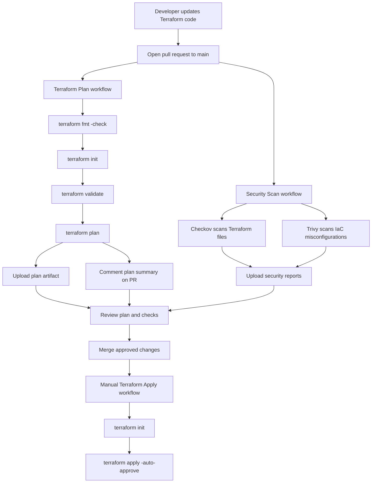

 

# Terraform CI/CD Template

A reusable Terraform CI/CD lab using GitHub Actions.

This project demonstrates a safe Infrastructure as Code workflow: formatting, validation, planning, security scanning, and a manual apply job. The Terraform example uses local/demo resources only, so the pipeline can be tested without creating paid cloud infrastructure.

**CI/CD** means a workflow automatically checks, tests, and optionally deploys code or infrastructure when changes are made.

---

## Purpose

This repository is a portfolio-friendly DevOps lab for learning and demonstrating Terraform automation.

It focuses on:

- Terraform workflow structure
- Pull request validation
- Security scanning for Infrastructure as Code
- Manual deployment control
- Clear documentation for cloud/support troubleshooting practice

The included Terraform is intentionally provider-neutral. It uses the `random` and `local` providers to generate a sample infrastructure JSON file instead of deploying real cloud resources.

---

## Repository Structure

```text
terraform-ci-cd-template/
|-- infra/
|   |-- main.tf              # Demo Terraform resources
|   |-- variables.tf         # Input variables
|   |-- outputs.tf           # Terraform outputs
|   `-- infrastructure.json  # Generated demo output
|-- .github/
|   `-- workflows/
|       |-- terraform-plan.yml
|       |-- terraform-apply.yml
|       `-- security-scan.yml
|-- SECURITY.md              # Security controls and triage notes
`-- docs/
    `-- assets/
        |-- github-actions-terraform-plan-success.png
        `-- github-actions-security-scan-success.png
```

---

## Workflow Architecture



---

## GitHub Actions Workflows

### 1. Terraform Plan

File: `.github/workflows/terraform-plan.yml`

Runs when a pull request targets `main`.

Steps:

- Checks out the repository
- Sets up Terraform
- Runs `terraform fmt -check`
- Runs `terraform init`
- Runs `terraform validate`
- Runs `terraform plan -out=tfplan`
- Saves readable plan output to `tfplan.txt`
- Uploads the binary and text plan as a workflow artifact
- Comments a summarized plan result on the pull request

If the plan fails, the workflow still uploads and comments available troubleshooting output before failing the job.

This protects the main branch by checking whether Terraform code is formatted, valid, and plannable before merge.

### 2. Security Scan

File: `.github/workflows/security-scan.yml`

Runs on pull requests to `main` and pushes to `main`.

Steps:

- Checks out the repository
- Runs Checkov against the Terraform code in `infra/`
- Uploads the Checkov JSON report as a workflow artifact
- Runs Trivy IaC scanning for high and critical misconfiguration risks
- Uploads Trivy SARIF results to GitHub code scanning
- Uploads the Trivy SARIF file as a workflow artifact

Because the current Terraform example is provider-neutral, these scans are mainly included to show where IaC security scanning fits in the pipeline. If this lab is expanded to Azure or AWS resources later, the scan results become more meaningful because real cloud resources will be checked for risky defaults.

See `SECURITY.md` for the security controls, common IaC risks, and triage process.

### 3. Terraform Apply

File: `.github/workflows/terraform-apply.yml`

Runs manually with `workflow_dispatch`.

Steps:

- Checks out the repository
- Sets up Terraform
- Runs `terraform init`
- Runs `terraform apply -auto-approve`

The apply job is manual on purpose. This is safer than automatically applying every merge to `main`, especially for a learning lab or portfolio template that may later be connected to real cloud resources.

---

## Example Terraform

The `infra/` folder contains demo Terraform code that:

- Generates a random demo storage name using `random_pet`
- Creates a local `infrastructure.json` file
- Outputs generated values for inspection

This keeps the project zero-cost while still showing the Terraform workflow used in real cloud projects.

---

## How To Use This Template

1. Add or update Terraform code in the `infra/` directory.
2. Open a pull request into `main`.
3. Review the Terraform Plan comment, uploaded plan artifact, Security Scan workflow results, and security artifacts.
4. Merge only after checks pass.
5. Run Terraform Apply manually if deployment is required.

---

## Recommended Branch Protection

For a real repository, protect the `main` branch with these checks:

- Require pull requests before merging.
- Require the Terraform Plan workflow to pass.
- Require the Security Scan workflow to pass.
- Require at least one reviewer approval.
- Block force pushes to `main`.

These controls make the lab closer to a real cloud support or DevOps workflow because infrastructure changes are reviewed before they can affect the main branch.

---

## Notes

- No cloud resources are created by the current demo Terraform code.
- The project is safe to run locally or in GitHub Actions.
- The apply workflow is manual by design.
- Checkov and Trivy are included to demonstrate IaC security scanning in CI/CD.
- This repository can be expanded later with a real Azure or AWS example.

---
